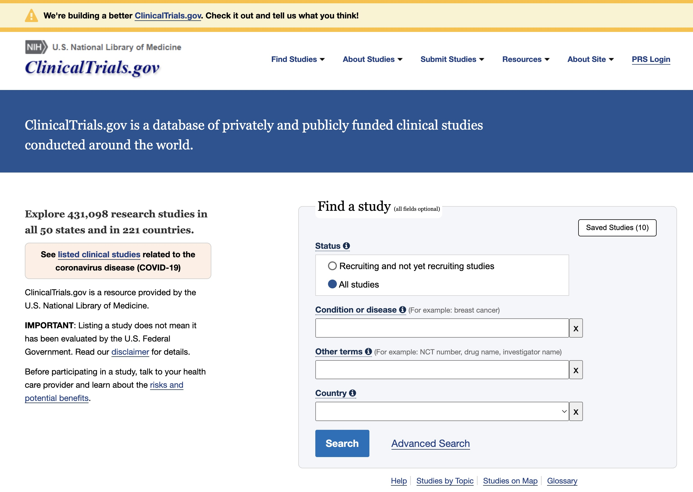

```{r setup, include=FALSE}
knitr::opts_chunk$set(echo = FALSE, warning = FALSE, message = FALSE)
library(plotly)
library(ggplot2)
library(palmerpenguins)
```

# Introduction and background

The [clinicaltrials.gov](https://clinicaltrials.gov) website is run by United States National Library of Medicine (NLM) and 
documents all clinical trials run in the United States. It is currently the largest clinical trial registry, containing
information about over 420,000 clinical trials from over 200 countries for various study types and indications. It is a public
resource aimed at whose intention is to improve access to trial information for individuals with serious disease and conditions. 
By FDA Regulation 21 CFR Parts 312 and 812 [@ctgovfda], trials occurring enrolling patients in the United States must include the following.

1. Federally and privately funded clinical trials;
2. The purpose of each experimental drug;
3. Subject eligibility criteria to participate in the clinical trial;
4. The location of clinical trial sites being used for a study; and
5. A point of contact for patients interested in enrolling in the trial.

```{r ctgsnap, out.width = "80%", fig.cap = "A snapshot of the clinicaltrials.gov landing page."}

```

Figure \@ref(fig:ctgsnap) provides a snapshot of the website that can be used to search trials. The search functionality is geared 
toward individuals searching for current or past trials of interest. The underlying data 
are stored in a relational database and can be access through the Clinical Trials Transformation
Initiative which "identifies and promotes practices to increase the quality and efficiency of clinical trials through projects that generate empirical data on 
how trials are currently conducted, leading to recommendations for improvement." [@ctti]
The associated website, https://aact.ctti-clinicaltrials.org/, 
provides documentation, schemas, and monthly snapshots of the data, which can be downloaded
as database dump files or pipe-delimited files at https://aact.ctti-clinicaltrials.org/download.

While the clinicaltrials.gov website is effective for curating trials and exploring their characteristics the database provides
new research avenues in the area of clinical trials facilitated by programmatic access. One immediate avenue is
in the trial planning phase where a therapy is being considered for development. This is one of the most preliminary steps for a sponsor in the 
drug development process. Its goal is to assess the therapies in the indication space, to assess risk associated with
development in the space, to set expectations for a drug program, and ultimately, to decided whether to invest in
the therapy given the goals and constraints of the sponsor.

Another immediate avenue is in understanding trends in drug development. @bhatnagar2022 identifies text sources,
particularly publications as valuable sources of information for identifying novel targets for
potential drug development and provides a summary of natural language processing (NLP) tools and their
use PubMed. @chen2021 goes further by identifying the most common tasks associated with NLP analyses
including event detection, trial recruitment, and drug repurposing. These and others tend to focus on
publications to derive new scientific knowledge and they face several significant challenges. First,
publications are unstructured. The data are follow the journal publishing guidelines/requirements but beyond
that their is not structure that can be used to estimate context, understand result, or assess impact without
relying on other sources of information like expert input or citation graphs. Second, they are multimodal, usually
comprised of text, equations, and visualizations. The analyses of the information conveyed in each of 
these representations are distinct sub-disciplines and the representation of the knowledge they contain 
is another. This means that extracting useful information, representing the information they contain, and
effectively using that information is an extremely challenging task. Finally, it is not often clear
how we assess the effectiveness or efficiency of efforts to extract actionable information. 
For example, if these semantic systems were to 
find a novel target it is not clear how many may have been missed or if the substantial effort that
went into the construction of the knowledge representation might have been better used with humans
reading a small subset of the publications curated by a careful search.

As a source for understanding drug development, the NLM's clinical trials database has several
advantages compared to publications. First, the data are semi-structured. The database
schema, published on the website, structures features of trials in a way that is consistent and a
data dictionary is also provided a clear description of what was recorded. Second, all of the
data are text, with many of the text fields denoting categories. This means that someone analyzing these
data are only multi-modal in the sense that we are dealing with categorical variables or free text and
its context is dictated by the schema. Finally, we can use the data to define tasks deemed useful, 
and evaluate them directly using the data, or using a human expert to validate results. For example,
a useful feature for understanding drug development trends is the identification of past trials
that were successful. The database has key features related to trial success including if the trial
has concluded, the trial design, the results of the trial analysis, and the p-value for primary 
and secondary endpoints. However, the trial success is not included and information including
the experiment type (non-inferiority or superiority) along with other factors in the database have been must be taken into 
account to make the assessment. The database facilitates the creation of derived features such as this that are
the estimates of a model and are validated by an expert. Their usefulness can then be justified
by their integration into the risk assessment described above, for example.

This paper presents the use of the `ctrialsgov` package, which provides functions and utilities
for a) preprocessing and ingestion of the clinical trials database for use in the \R programming 
environment @rcore 
b) enhanced and optimized query and search capabilities beyond what is provide by https://clinicaltrials.gov
c) visualization and exploration functions and
d) NLP preprocessing for integration into text analyses.
The package was developed for applications in trial planning, program assessment, identifying trends in drug
development, and quantifying program and portfolio risk. However, the package was designed to be general and extensible. 
It is likely that it could be used effectively in many adjacent areas of research.

The rest of the paper is laid out as follows.

# Acquiring and preprocessing the data

- How is the raw data provided?
- What is the timeline for the snapshots?
- How do we acquire the snapshots?
- How do we create the database the raw data set? Why did we choose DuckDB for this?
- How do we create the derived data set? How is it different from the raw-data database?

```{r, echo = FALSE, eval = FALSE}
library(ctrialsgov)
library(duckdb)
library(DBI)

con = dbConnect(duckdb(file.path("ctrialsgovdb", "ctrialsgov.duckdb")))
ctgov_create_data(con, file.path("ctrialsgovdb", "ctrialsgov-derived.duckdb"))
```

# Querying trials

```{r}
ctgov_load_duckdb_file(file.path("ctrialsgovdb", "ctrialsgov-derived.duckdb"))
```

```{r}
library(tibble)

pembro = ctgov_query(
  study_type = "Interventional",
  sponsor_type = "INDUSTRY",
  official_title_kw = c("Pembrolizumab", "KEYNOTE"),
  sponsor_kw = "Merck") |>
  as_tibble()

nivo = ctgov_query(
  study_type = "Interventional",
  sponsor_type = "INDUSTRY",
  official_title_kw = "Nivolumab",
  sponsor_kw = "Bristol-Myers Squibb") |> 
  as_tibble()

atezo = ctgov_query(
  study_type = "Interventional",
  sponsor_type = "INDUSTRY",
  official_title_kw = "Atezolizumab",
  sponsor_kw = c("Hoffmann-La Roche", "Genentech, Inc.")) |>
  as_tibble()
```
# Visualizing trials


```{r}
x = bind_rows(pembro, nivo, atezo)

ctgov_plot_timeline(pembro, color = "phase")
```
- Timelines
- Concurrent trials

# Application: A regression with TFIDF and endpoint met

# Conclusions

Interactive data graphics provides plots that allow users to interact them. One of the most basic types of interaction is through tooltips, where users are provided additional information about elements in the plot by moving the cursor over the plot.

This paper will first review some R packages on interactive graphics and their tooltip implementations. A new package \CRANpkg{ToOoOlTiPs} that provides customized tooltips for plot, is introduced. Some example plots will then be given to showcase how these tooltips help users to better read the graphics. 

# Background

Some packages on interactive graphics include \CRANpkg{plotly} [@plotly] that interfaces with Javascript for web-based interactive graphics, \CRANpkg{crosstalk} [@crosstalk] that specializes cross-linking elements across individual graphics.  The recent R Journal paper \CRANpkg{tsibbletalk} [@RJ-2021-050] provides a good example of including interactive graphics into an article for the journal. It has both a set of linked plots, and also an animated gif example, illustrating linking between time series plots and feature summaries.

# Customizing tooltip design with \pkg{ToOoOlTiPs}

\pkg{ToOoOlTiPs} is a packages for customizing tooltips in interactive graphics, it features these possibilities.

# A gallery of tooltips examples

The \CRANpkg{palmerpenguins} data [@palmerpenguins]  features three penguin species which has a lovely illustration by Alison Horst in Figure \@ref(fig:penguins-alison). 

```{r penguins-alison, out.width = "100%", out.height = "30%", fig.cap = "Artwork by \\@allison\\_horst", fig.alt="A picture of three different penguins with their species: Chinstrap, Gentoo, and Adelie. "}
knitr::include_graphics("penguins.png")
```

Table `r knitr::asis_output(ifelse(knitr::is_html_output(), '\\@ref(tab:penguins-tab-interactive)', '\\@ref(tab:penguins-tab-static)'))` prints at the first few rows of the `penguins` data:

```{r penguins-tab-interactive, eval = knitr::is_html_output(), layout = "l-body-outset"}
knitr::kable(head(penguins), format = "html", caption = "A basic table")
```

```{r penguins-tab-static, eval = knitr::is_latex_output()}
knitr::kable(head(penguins), format = "latex", caption = "A basic table") %>% 
  kableExtra::kable_styling(font_size = 7)
```   

Figure `r knitr::asis_output(ifelse(knitr::is_html_output(), '\\@ref(fig:penguins-plotly)', '\\@ref(fig:penguins-ggplot)'))` shows an `r ifelse(knitr::is_html_output(), 'interactive', '')` plot of the penguins data, made using the `r knitr::asis_output(ifelse(knitr::is_html_output(), '\\CRANpkg{plotly}', '\\CRANpkg{ggplot2}'))` package. 

```{r penguins-plotly, echo = TRUE, fig.height = 5, fig.cap="A basic interactive plot made with the plotly package on palmer penguin data. Three species of penguins are plotted with bill depth on the x-axis and bill length on the y-axis. When hovering on a point, a tooltip will show the exact value of the bill depth and length for that point, along with the species name.", include=knitr::is_html_output(), eval=knitr::is_html_output(), fig.alt = "A scatterplot of bill length against bill depth, both measured in millimetre. The three species are shown in different colours and loosely forms three clusters. Adelie has small bill length and large bill depth, Gentoo has small bill depth but large bill length, and Chinstrap has relatively large bill depth and bill length."}
p <- penguins %>% 
  ggplot(aes(x = bill_depth_mm, y = bill_length_mm, 
             color = species)) + 
  geom_point()
ggplotly(p)
```

```{r penguins-ggplot, echo = TRUE, fig.height = 5, fig.cap="A basic non-interactive plot made with the ggplot2 package on palmer penguin data. Three species of penguins are plotted with bill depth on the x-axis and bill length on the y-axis. Visit the online article to access the interactive version made with the plotly package.", include=knitr::is_latex_output(), eval=knitr::is_latex_output()}
penguins %>% 
  ggplot(aes(x = bill_depth_mm, y = bill_length_mm, 
             color = species)) + 
  geom_point()
```

# Summary

We have displayed various tooltips that are available in the package \pkg{ToOoOlTiPs}. 
