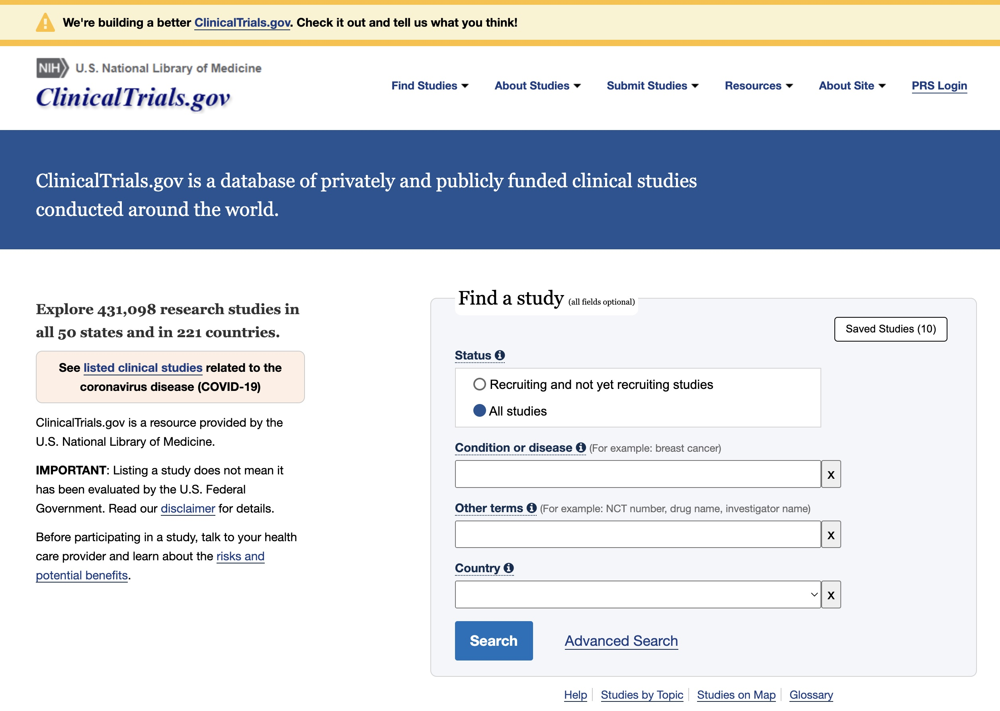
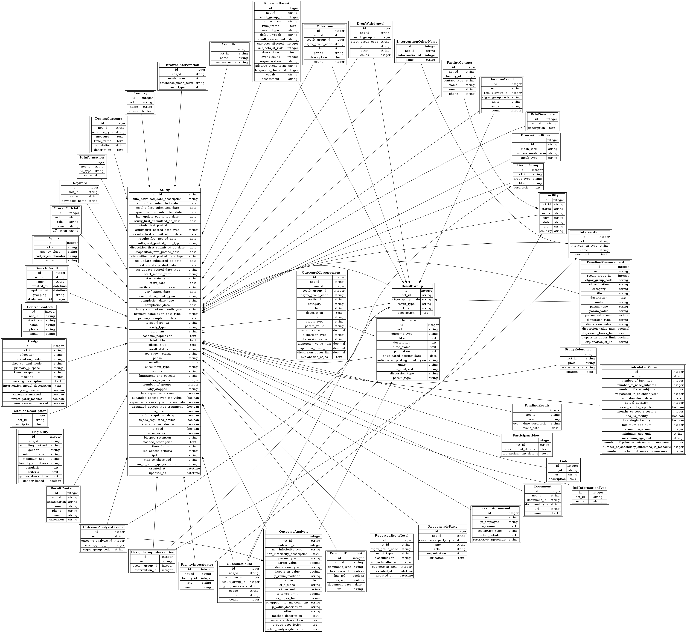

```{r setup, include=FALSE}
knitr::opts_chunk$set(echo = TRUE, warning = FALSE, message = FALSE)
library(ctrialsgov)
library(dplyr)
theme_set(theme_minimal())
```

# Introduction and background

The [clinicaltrials.gov](https://clinicaltrials.gov) website is run by United States National Library
of Medicine (NLM) and documents all clinical trials run in the United States. It is currently the
largest clinical trial registry, containing information about over 420,000 clinical trials from over
200 countries for various study types and indications. It is a public resource aimed at whose intention
is to improve access to trial information for individuals with serious disease and conditions. By FDA
Regulation 21 CFR Parts 312 and 812 [@ctgovfda], trials occurring enrolling patients in the United
States must include the following.

1. Federally and privately funded clinical trials;
2. The purpose of each experimental drug;
3. Subject eligibility criteria to participate in the clinical trial;
4. The location of clinical trial sites being used for a study; and
5. A point of contact for patients interested in enrolling in the trial.

```{r ctgsnap, out.width = "80%", fig.cap = "A snapshot of the clinicaltrials.gov landing page.", echo=FALSE}

```

Figure \@ref(fig:ctgsnap) provides a snapshot of the website that can be used to search trials.
The search functionality is geared toward individuals searching for current or past trials of
interest. The underlying data are stored in a relational database and can be access through the
Clinical Trials Transformation Initiative which "identifies and promotes practices to increase
the quality and efficiency of clinical trials through projects that generate empirical data on 
how trials are currently conducted, leading to recommendations for improvement." [@ctti]
The associated website, https://aact.ctti-clinicaltrials.org/, provides documentation, schemas,
and monthly snapshots of the data, which can be downloaded as database dump files or pipe-delimited
files at https://aact.ctti-clinicaltrials.org/download.

While the clinicaltrials.gov website is effective for curating trials and exploring their
characteristics the database provides new research avenues in the area of clinical trials
facilitated by programmatic access. One immediate avenue is in the trial planning phase where
a therapy is being considered for development. This is one of the most preliminary steps for a
sponsor in the drug development process. Its goal is to assess the therapies in the indication
space, to assess risk associated with development in the space, to set expectations for a drug
program, and ultimately, to decided whether to invest in the therapy given the goals and
constraints of the sponsor.

Another immediate avenue is in understanding trends in drug development. @bhatnagar2022 identifies
text sources, particularly publications as valuable sources of information for identifying novel
targets for potential drug development and provides a summary of natural language processing (NLP)
tools and their use PubMed. @chen2021 goes further by identifying the most common tasks associated
with NLP analyses including event detection, trial recruitment, and drug repurposing. These and
others tend to focus on publications to derive new scientific knowledge and they face several
significant challenges. First, publications are unstructured. The data are follow the journal
publishing guidelines/requirements but beyond that their is not structure that can be used to
estimate context, understand result, or assess impact without relying on other sources of
information like expert input or citation graphs. Second, they are multimodal, usually
comprised of text, equations, and visualizations. The analyses of the information conveyed in
each of these representations are distinct sub-disciplines and the representation of the
knowledge they contain is another. This means that extracting useful information, representing
the information they contain, and effectively using that information is an extremely challenging
task. Finally, it is not often clear how we assess the effectiveness or efficiency of efforts to
extract actionable information. For example, if these semantic systems were to 
find a novel target it is not clear how many may have been missed or if the substantial effort that
went into the construction of the knowledge representation might have been better used with humans
reading a small subset of the publications curated by a careful search.

As a source for understanding drug development, the NLM's clinical trials database has several
advantages compared to publications. First, the data are semi-structured. The database
schema, published on the website, structures features of trials in a way that is consistent and a
data dictionary is also provided a clear description of what was recorded. Second, all of the
data are text, with many of the text fields denoting categories. This means that someone analyzing these
data are only multi-modal in the sense that we are dealing with categorical variables or free text and
its context is dictated by the schema. Finally, we can use the data to define tasks deemed useful, 
and evaluate them directly using the data, or using a human expert to validate results. For example,
a useful feature for understanding drug development trends is the identification of past trials
that were successful. The database has key features related to trial success including if the trial
has concluded, the trial design, the results of the trial analysis, and the p-value for primary 
and secondary endpoints. However, the trial success is not included and information including
the experiment type (non-inferiority or superiority) along with other factors in the database have
been must be taken into account to make the assessment. The database facilitates the creation of
derived features such as this that are the estimates of a model and are validated by an expert.
Their usefulness can then be justified by their integration into the risk assessment described above,
for example.

This paper presents the use of the **ctrialsgov** package, which provides functions and utilities
for a) preprocessing and ingestion of the clinical trials database for use in the \R programming 
environment @rcore b) enhanced and optimized query and search capabilities beyond what is provide
by https://clinicaltrials.gov c) visualization and exploration functions and d) NLP preprocessing
for integration into text analyses. The package was developed for applications in trial
planning, program assessment, identifying trends in drug development, and quantifying program
and portfolio risk. However, the package was designed to be general and extensible.  It is
likely that it could be used effectively in many adjacent areas of research.

The rest of the paper is laid out as follows. 


# Acquiring and preprocessing the data

Through the *Clinical Trials Transformative Initiative* website, one can directly
download the existing clinical trials database as either a PostgreSQL database files or as
a collection of compressed, pipe-deliminated files. Dumps of the database are updated on a
daily basis throughout the current month. Monthly archives of the database, stored in the
same format, are available all the way back through mid-2017. All studies are included in
the most recent snapshot; the archives are only needed to find the history of how study
details have been edited over time.

While the current clinical trials database can be easily accessed, the structure of
the records is relatively complex. A schema of all of the tables is visualized in
Figure \@ref(fig:schema). The files are also quite large; as of late 2020, the
compressed files are around 1.4GB. These features make the raw dataset difficult to
work on directly without extensive pre-processing. This pre-processing step is one
of the core functions of the **ctrialsgov** package.

```{r schema, out.width = "80%", fig.cap = "Schema of the downloadable clinicaltrials.gov database.", echo=FALSE}

```

The package contains a small subset of the clinical trials database for testing
and examples. Most users, however, will want to create a local copy of the entire
clinical trials dataset from a recent snapshot. This process involves downloading
the most recent database dump, loading those tables into a temporary local
database, running a sequence of cleaning functions, and finally, storing a 
simplified version of the entire database that can be queried in R using the
functions provided by **ctrialsgov**. All of these steps have been packaged
together in the `ctgov_get_latest_snapshot`. The example below shows the
code to create a simplified, local version of the most recent database dump,
with all of the output files stored in a directory named "db".  

```{r, eval = FALSE}
ctgov_get_latest_snapshot(
  db_path = file.path("db", "ctgov.duckdb"),
  db_derived_path = file.path("db", "ctgov-derived.duckdb")
)
```

As shown in the above code, the files created in this process have the extension
".duckdb". These are database files from the database backend of the same name,
accessible within R using the `duckdb` package. Our process both for creating
the derived datasets and, as shown in the next section, querying them, works 
primarily through working with tables written using the DuckDB driver. DuckDB 
gives us the benefits of working within a database, including the ability to
avoid reading all of the data into memory. However, unlike options such as
PostgreSQL, does not require any additional dependencies on the end-user beyond
installing the R package. All of the database information is stored in a single
file (i.e., the "ctgov-derived.duckdb" referenced above) and all of the computation
is done by code included with the `duckdb` package.

The tables stored after the pre-processing step extract the most important 
fields from the original database and combine them into six tables. The
primary table contains one row for each study along with all of the
study-level variables. The other tables store information that require multiple
rows for each trial and cannot be easily combined. For example, one table 
includes a row for each reported outcome of the study and another has one
row for every intervention. The structure of these tables is explored in 
the following section. In addition to information directly available in
the raw data, we include two additional derived variables that are particularly
helpful for further processing. Using the results information, which in the
most detailed cases includes p-values and test statistics, we supply an
algorithmically-derived estimate of whether the trial outcomes where met or not.
Further, we provide a set of keywords that attempt to standardize the disease
types under consideration. Both of these additional features are shown in this
paper's two case studies.

# Querying trials

Before querying the ClinicalTrials.gov data, we need to load a pre-processed
version of the data into R. Assuming we have created a version based on the
most recent snapshot of data from ClinicalTrials.gov as in the section above,
the following code will load the data we created. Note that creation of the
data above needs to be done only once but the table needs to be read into R
at the start of the each session.

```{r}
ctgov_load_duckdb_file(file.path("db", "ctgov-derived.duckdb"))
```

The primary function for querying the dataset is called `ctgov_query()`. It can
be called after using any of the functions in the previous section. Here
are a few examples of how the function works. We will see a few examples here;
see the help pages for a complete list of options. There are a number of fields
in the data that use exact matches of categories. Here, for example, we find the
interventional studies:

```{r}
ctgov_query(study_type = "Interventional")
```

Or, all of the interventional studies that have a primary industry sponsor:

```{r}
ctgov_query(study_type = "Interventional", sponsor_type = "INDUSTRY")
```

A few fields have continuous values that can be searched by giving a vector
with two values. The results return any values that fall between the lower
bound (first value) and the upper bound (second value). Here, we find the
studies that have between 40 and 42 patients enrolled in them:

```{r}
ctgov_query(enrollment_range = c(40, 42))
```

Setting one end of the range to missing avoids searching for that end of the
range. For example, the following finds any studies with 1000 or more patients.

```{r}
ctgov_query(enrollment_range = c(1000, NA))
```

Similarly, we can give a range of dates. These are given in the form of strings
as "YYYY-MM-DD":

```{r}
ctgov_query(date_range = c("2020-01-01", "2020-02-01"))
```

Finally, we can also search free text fields using keywords. The following for
example finds and study that includes the phrase "lung cancer" (ignoring
case) in the description field:

```{r}
ctgov_query(description_kw = "lung cancer")
```

We can search two terms at once as well, by default it finds things that match
at least one of the terms:

```{r}
ctgov_query(description_kw = c("lung cancer", "colon cancer"))
```

But the `match_all` flag can be set to search for both terms at the same time
(here, that returns no matches):

```{r}
ctgov_query(description_kw = c("lung cancer", "colon cancer"), match_all = TRUE)
```

Other keyword fields include `official_title_kw`,
`source_kw` and `criteria_kw`.

Any of the options can be combined as needed.

```{r}
ctgov_query(
  description_kw = "cancer",
  enrollment_range = c(100, 200),
  date_range = c("2019-01-01", "2020-02-01")
)
```

Finally, we can also pass a current version of the data set to the query
function, rather than starting with the full data set. This is useful when
you want to combine queries in a more complex way. For example, this is
equivalent to the above:

```{r, eval=FALSE}
ctgov_query() |>
  ctgov_query(description_kw = "cancer") |>
  ctgov_query(enrollment_range = c(100, 200)) |>
  ctgov_query(date_range = c("2019-01-01", "2020-02-01"))
```

In addition to the main query function, the package includes five additional
query functions to search the other tables in the processed dataset.
Specifically, these are `ctgov_query_design()`, `ctgov_query_endpoint()`,
`ctgov_query_intervention()`, `ctgov_query_outcome()`, and `ctgov_query_references()`.
Each table can be joined through the "nct_id" key as well as queried based on 
the columns present in the datasets. The output of all these functions is a
normal R `tibble` object that can be plotted directly. The package includes
several wrapper functions for creating some of the most common visualizations
of the data from the query function, which we will explore in the next section.

# Application: Visualizing drug trials over time

The visualization techniques included in the **ctrialsgov** package are designed
to show the evolution of a set of clinical trials focused on a specific
treatment or disease area. As an application, we will show how the tools in the
package help us understand the clinical trial progression of three relatively
new cancer treatment drugs: Pembrolizumab, Nivolumab, and Atezolizumab. These
are particularly interesting to look at because they target a variety of
different cancer types and have required several rounds of trials to investigate
their efficacy on each subtype.

To start, we will use our query function to grab all of the Interventional
trials sponserved by Merck that include "Pembrolizumab" in their title. This
produces a set of 200 trials.

```{r}
pembro <- ctgov_query(
  study_type = "Interventional",
  sponsor_type = "INDUSTRY",
  official_title_kw = c("Pembrolizumab"),
  sponsor_kw = "Merck")
pembro
```

Using the `ctgov_plot_timeline` function, we can visualize the start and dates
of each of these trials along with their phases. The object returned by the
function is an ordinary ggplot, which allows us to further modify it based on
our needs. Here, we'll make the font size of the axes a bit smaller add more
breaks to the dates to make them easier to read.

```{r, fig.height=10, fig.width=7}
ctgov_plot_timeline(pembro) +
  scale_x_date(date_breaks = "1 year", date_labels = "'%y") +
  theme(text = element_text(size = 6))
```

We can perform a similar analysis with trials of "Nivolumab" done by
Bristol-Myers Squibb. Here, we'll pipe the data directly into the plot function
as one long chain, along with the same tweaks to the plot as above.

```{r, fig.height=10, fig.width=7}
ctgov_query(
  study_type = "Interventional",
  sponsor_type = "INDUSTRY",
  official_title_kw = "Nivolumab",
  sponsor_kw = "Bristol-Myers Squibb") %>%
  ctgov_plot_timeline() +
  scale_x_date(date_breaks = "1 year", date_labels = "'%y") +
  theme(text = element_text(size = 6))
```

And a similar plot of Hoffmann-La Roche trials of the drug Atezolizumab.

```{r, fig.height=10, fig.width=7}
ctgov_query(
  study_type = "Interventional",
  sponsor_type = "INDUSTRY",
  official_title_kw = "Atezolizumab",
  sponsor_kw = c("Hoffmann-La Roche", "Genentech, Inc.")) %>%
  ctgov_plot_timeline() +
  scale_x_date(date_breaks = "1 year", date_labels = "'%y") +
  theme(text = element_text(size = 6))
```

Analysis of these?!

# Application: Predicting endpoints met


```{r}

```


