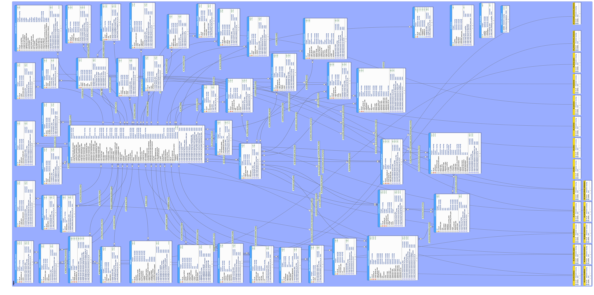
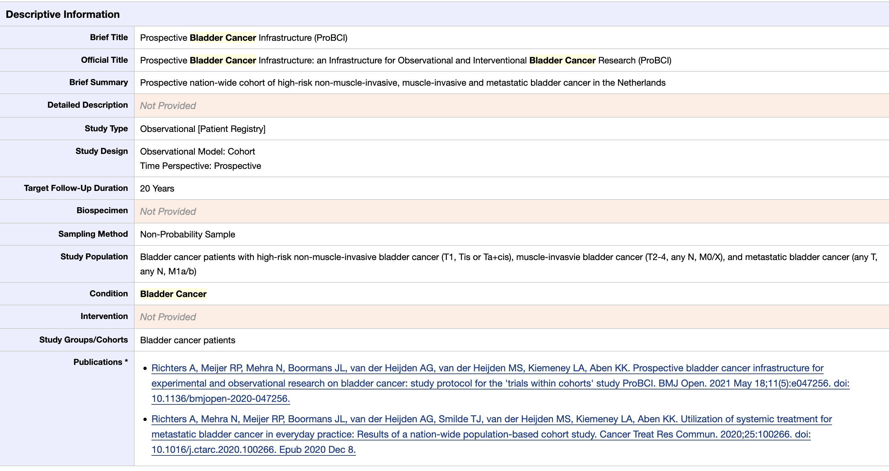

class: center, inverse, middle, title-slide

# 1. Introduction

---

```{r xaringan-themer, include=FALSE, warning=FALSE}
library(xaringanthemer)
style_mono_accent(
  base_color = "#1c5253",
  header_font_google = google_font("Josefin Sans"),
  text_font_google   = google_font("Montserrat", "300", "300i"),
  code_font_google   = google_font("Fira Mono"),
  base_font_size     = "16px",
)
```

# Authors and Installation

The package is a collaboration between:

- Taylor Arnold, University of Richmond
- Michael Kane, Yale University
- Auston Wei, Cleveland Clinic

It can be installed using devtools:

```{r, eval=FALSE}
devtools::install_github("presagia-analytics/ctrialsgov")
```

And should be on CRAN by the end of the month.

---

# ClinicalTrials.gov

The ClinicalTrials.gov website provides a database of clinical studies from
around the world. It is maintained by the U.S. National Library of Medicine and
the NIH.

The site does a great job of documenting and making available to entire database
to download and use locally. However, there are two challenges to using the
database directly for many applications:

1. The data are normalized across dozens of tables.
2. Much of the most important information is only available in free text fields.

---

# Schema

```{r, echo=FALSE, out.width="100%", fig.cap="", fig.align='center'}

```

---

# Example Trial (web interface)

```{r, echo=FALSE, out.width="100%", fig.cap="", fig.align='center'}

```

---

# Goals

The goals of the package are to provide an easy interface for querying the
ClinicalTrials.gov database and returning a single, combined data frame for
analysis. We also provide some helper functions for visualizing and exploring
the results, particularly the free text fields.

---
class: center, inverse, middle, title-slide

# 2. Usage

---

## Create the Data I: Package Sample

Before querying the ClinicalTrials.gov data, we need to load a pre-processed
version of the data into R. There are three ways to do this. The easiest is
to load a small sample dataset (2% of the total) that is included with the
package itself using the following:

```{r}
library(ctrialsgov)
ctgov_load_sample()
```

This is the version of the data that is used in most of the tests, examples,
and in this presentation.

---

## Create the Data II: Static Version

Alternatively, we can download a static version of the data from GitHub and
load this into R without needing the setup a local version of the database.
This will be cached locally so that it can be re-loaded without downloading
each time. To download and load this data, use the following:

```{r, eval=FALSE}
ctgov_load_cache()
```

The static dataset is updated monthly.

---

## Create the Data III: Create

Finally, if you have installed a copy of the database locally into PostGRES,
the data can be created from scratch with the following block of code (it will
take a couple of minutes to finish):

```{r, eval=FALSE}
library(DBI)
library(RPostgreSQL)

drv <- dbDriver('PostgreSQL')
con <- DBI::dbConnect(drv, dbname="aact")
ctgov_create_data(con)
```

This is the method we used to create the other two datasets.

---

## Querying the Data

The primary function for querying the dataset is called `ctgov_query`. It can
be called after using any of the functions in the previous section. Here
are a few examples of how the function works. We will see a few examples here;
see the help pages for a complete list of options.

There are a number of fields in the data that use exact matches of categories.
Here, for example, we find the interventional studies:

```{r}
ctgov_query(study_type = "Interventional")
```

---

## Querying the Data, cont.

Or, all of the interventional studies that have a primary industry sponsor:

```{r}
ctgov_query(study_type = "Interventional", sponsor_type = "Industry")
```

---

## Querying the Data: Continuous values

A few fields have continuous values that can be searched by giving a vector
with two values. The results return any values that fall between the lower
bound (first value) and the upper bound (second value). Here, we find the
studies that have between 40 and 42 patients enrolled in them:

```{r}
ctgov_query(enrollment_range = c(40, 42))
```

---

## Querying the Data: Continuous values, cont.

Setting one end of the range to missing avoids searching for that end of the
range. For example, the following finds any studies with 1000 or more patients.

```{r}
ctgov_query(enrollment_range = c(1000, NA))
```

---

## Querying the Data: Dates

Similarly, we can give a range of dates. These are given in the form of strings
as "YYYY-MM-DD":

```{r}
ctgov_query(date_range = c("2020-01-01", "2020-02-01"))
```

---

## Querying the Data: Keywords

Finally, we can also search free text fields using keywords. The following for
example finds and study that includes the phrase "lung cancer" (ignoring
case) in the description field:

```{r}
ctgov_query(description_kw = "lung cancer")
```

---

## Querying the Data: Multiple terms

We can search two terms at once as well, by default it finds things that match
at least one of the terms:

```{r}
ctgov_query(description_kw = c("lung cancer", "colon cancer"))
```

---

## Querying the Data: Match all

But the `match_all` flag can be set to search for both terms at the same time
(here, that returns no matches):

```{r}
ctgov_query(description_kw = c("lung cancer", "colon cancer"), match_all = TRUE)
```

---

## Querying the Data: Other text fiels

Other keyword fields include `official_title_kw`, `source_kw` and `criteria_kw`.

Any of the options can be combined as needed.

```{r}
ctgov_query(
  description_kw = "cancer",
  enrollment_range = c(100, 200),
  date_range = c("2019-01-01", "2020-02-01")
)
```

---

## Querying the Data: Pipes

Finally, we can also pass a current version of the data set to the query
function, rather than starting with the full data set. This is useful when
you want to combine queries in a more complex way. For example, this is
equivalent to the above:

```{r, message=FALSE}
library(dplyr)

ctgov_query() %>%
  ctgov_query(description_kw = "cancer") %>%
  ctgov_query(enrollment_range = c(100, 200)) %>%
  ctgov_query(date_range = c("2019-01-01", "2020-02-01"))
```

---
class: center, inverse, middle, title-slide

# 3. Text Analysis

---

## Keywords in Context

The function `ctgov_kwic` highlights all of the occurances of a term within
its context (the few words before and after the term occurs). For example, if
we want to show the occurances of the term "bladder" in the titles of the
interventional trials we can do this:

```{r}
z <- ctgov_query(study_type = "Interventional")
ctgov_kwic("bladder", z$brief_title)
```

---

## Keywords in Context, cont.

The function also has an option to include a title along with each occurance
that is printed alongside each row. Here we will print the NCT id for each
trial:

```{r}
z <- ctgov_query(study_type = "Interventional")
ctgov_kwic("bladder", z$brief_title, z$nct_id)
```

---

## Keywords in Context, cont.

There are some other options that can be used to change the way that the
output is displayed. The default (shown above) prints the results out using
the `cat` function. Other options return the results as a character vector of
data frame, which are useful for further post-processing. There is also a
flag `use_color` that prints the term in color rather than with pipes; it looks
great in a terminal or RStudio but does not display correctly when knit to
HTML.

---

## TF-IDF

We can use a technique called term frequence-inverse document frequency (TF-IDF)
to determine the most important words in a collection of of text fields. To
implement this in R we will use the `ctgov_tfidf` function:

```{r}
z <- ctrialsgov::ctgov_query()
tfidf <- ctgov_tfidf(z$description)
print(tfidf, n = 15L)
```

---

## TF-IDF, cont.

The default takes the lower case version of the terms, but (particularly with
acronyms) it may be better to preserve the capitalization of the terms. Here is
how we can do that in this example:

```{r}
tfidf <- ctgov_tfidf(z$description, tolower = FALSE)
print(tfidf, n = 15L)
```

---

## TF-IDF, cont.

We can also refine the results by including fewer rare terms. The argument
`min_df` specifies the minimal proportion of documents that must contain a term
for it to be returned as a keyword; the upper bound can also be specified
with the argument `max_df`.

```{r}
tfidf <- ctgov_tfidf(z$description, min_df = 0.02, max_df = 0.2)
print(tfidf, n = 15L)
```

---

## Document Similarity

Finally, the package also provides a function for producing similarity scores
based on the text fields of the studies. Here, we will produce a similarity
matrix based on the description field of Interventional, Industry-sponsored,
Phase 2 trials.

```{r}
z <- ctgov_query(
  study_type = "Interventional", sponsor_type = "Industry", phase = "Phase 2"
)
scores <- ctgov_text_similarity(z$description, min_df = 0, max_df = 0.1)
dim(scores)
```

The returned value is a square matrix with one row and one colum for each
clinical trial in the set. We can use these scores to find studies that are
particularly close to one another in the words used within their descriptions.

---

## Document Similarity, cont.

Here for example we can see five studies that use similar terms in their
descriptions:

```{r}
index <- order(scores[,100L], decreasing = TRUE)[seq_len(15L)]
z$brief_title[index]
```

Further post-processing can be done with the similarity scores, such as spectral
clustering and dimensionality reduction.

---
class: center, inverse, middle, title-slide

# 4. Conclusions

---

The **ctrialsgov** package provides an easy-to-use interface for querying the
ClinicalTrials.gov database and several helpful functions for post-processing
the results. It can be downloaded here:

```{r, eval=FALSE}
devtools::install_github("presagia-analytics/ctrialsgov")
```

We welcome any comments or questions using GitHub issues or directly by
email at **tarnold2@richmond.edu**.
